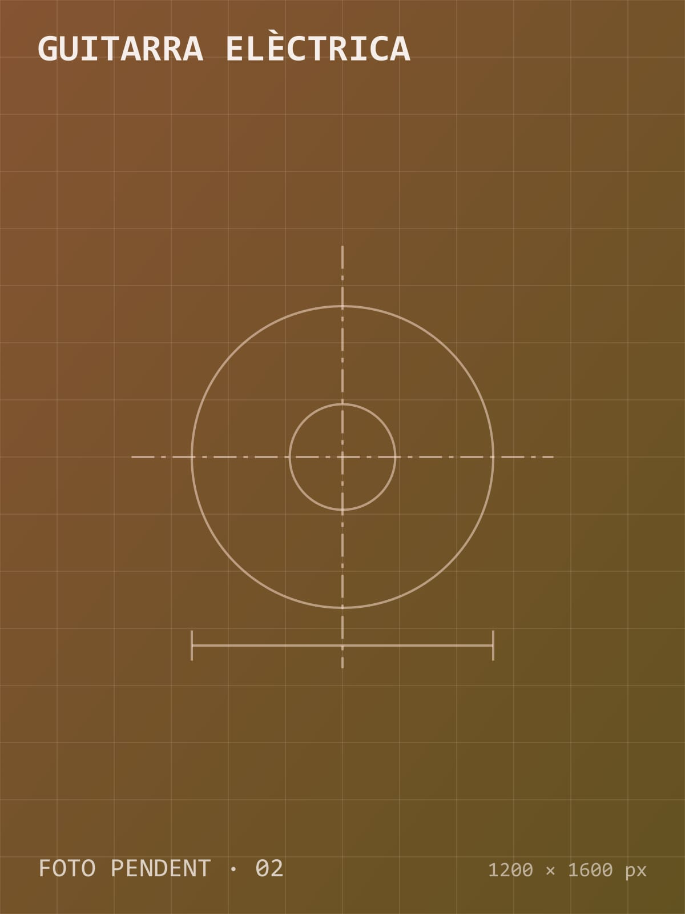

> **Texto de prueba.** Sustituye este contenido por la descripción real del proyecto.

## Objetivo

Diseñar una guitarra completamente paramétrica, de modo que la escala, el perfil del mástil y la forma del cuerpo se puedan modificar desde una tabla de variables, y fabricar un prototipo funcional.

## Diseño

El modelo de **SolidWorks** se controla con una tabla de diseño. Calculé la tensión total de las cuerdas (≈ 450 N) y dimensioné el alma del mástil para que la flecha máxima quedara por debajo de 0,3 mm.

## Fabricación

Las trayectorias de mecanizado se generaron con **Fusion 360 CAM** y el cuerpo se fresó en fresno. Los trastes, la electrónica y el acabado se hicieron a mano.

## Resultados

- Acción de 1,8 mm en el traste 12 sin trasteos.
- Tiempo de fresado del cuerpo inferior a 3 horas.
