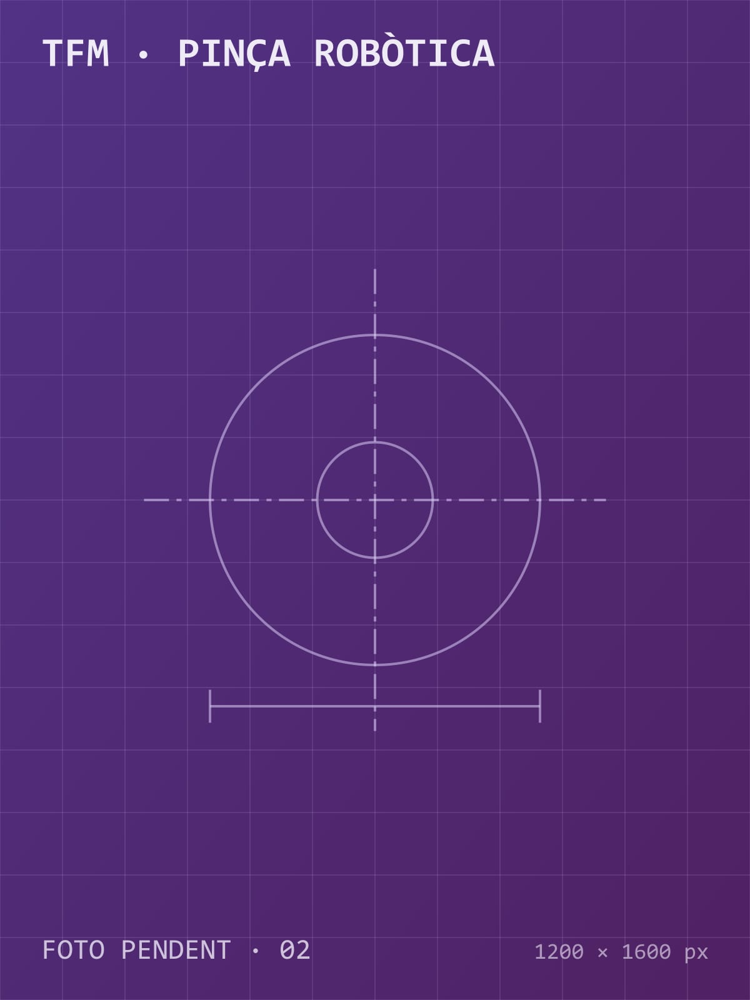

> **Placeholder text.** Replace this content with the real project description.

## Goal

To develop a gripper for a collaborative robot that adapts to the shape of the part without a tool change, reducing weight and cost compared to commercial solutions.

## Design and optimisation

After a concept generation phase, the gripper body was topology-optimised in **Ansys Mechanical**, reducing its mass by 35 %. Finger kinematics were studied in **MATLAB**.

## Validation

The prototype was made by SLS and tested with 12 parts of different geometries, with a 96 % grasp success rate.
